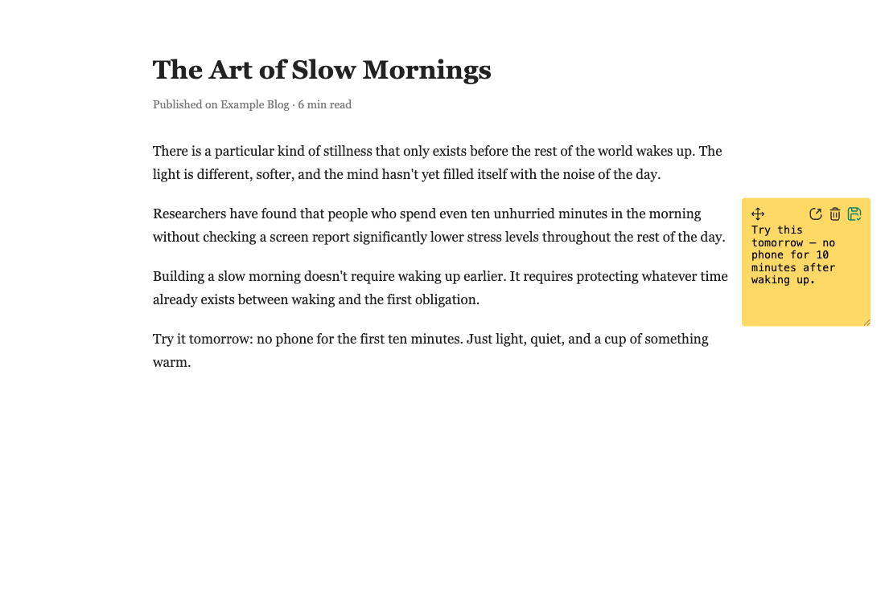
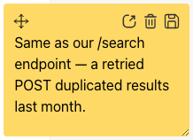
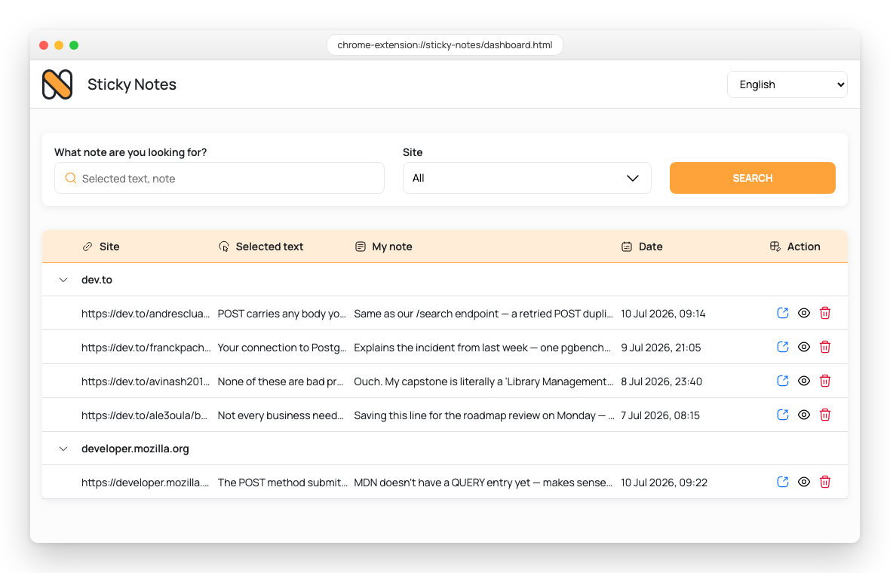

# Sticky Notes (Website Stickies)

A Chrome extension that lets you highlight text on any website and leave a sticky note right next to it. Notes are saved automatically, stay attached to the page you wrote them on, and are all searchable from a dashboard. Supports 11 languages, including English, Turkish, Spanish, German, Japanese, French, Portuguese, Russian, Mandarin, Indonesian, and Arabic.



## Features

- **Add a note anywhere** — select text on any page, right-click, choose *Add Note*.
- **Drag, resize, and it autosaves** — no save button required, though there is one.
- **Dashboard** — every note you've written, grouped by site, searchable and filterable.
- **Multi-language UI** — defaults to your browser's language; switch anytime from the dashboard.

## Installation

This extension isn't on the Chrome Web Store — install it as an unpacked extension:

1. Download or clone this repository.
2. Open Chrome and go to `chrome://extensions`.
3. Turn on **Developer mode** (top-right toggle).
4. Click **Load unpacked** and select the folder you cloned this repo into.
5. The Sticky Notes icon appears in your toolbar — pin it for quick access.

## Usage

### Add a note

1. Select some text on any website.
2. Right-click the selection and choose **Add Note**.
3. A sticky note appears next to your selection — type in it and it saves automatically as you type (or hit the save icon for an immediate save).



Each note has four controls:

| Button | Action |
| --- | --- |
| Move | Drag the note anywhere on the page; its position is remembered. |
| Dashboard | Save and jump straight to the notes dashboard. |
| Delete | Remove the note (from this page and from your saved notes). |
| Save | Save immediately — a green checkmark confirms it worked. |

Notes only appear on the page they were created on, and reappear automatically every time you revisit that page.

### Browse and search your notes

Click the extension icon and choose **View all notes** to open the dashboard.



From the dashboard you can:
- **Search** by note content or the text you originally selected.
- **Filter by site** using the dropdown.
- **Collapse/expand** each site's group of notes.
- **Open** the original page, **preview** a note, or **delete** it — deletions sync live across every open dashboard tab, no reload needed.
- **Switch language** from the dropdown in the top-right corner of the header.

## Project structure

```
manifest.json         Extension manifest (Manifest V3)
scripts/
  background.js        Service worker: context menu, storage writes
  card.js               Shared note UI: create/save/drag/delete (content script)
  content.js            Restores saved notes when a page loads (content script)
  dashboard.js          Notes dashboard logic
  popup.js              Toolbar popup logic
  i18n.js               Translation dictionaries + language helpers
dashboard.html / popup.html
styles/
assets/
```

## Privacy

All notes are stored locally in your browser (`chrome.storage.local`). Nothing is sent to any server.

## Contributing

Contributions are welcome. See [CONTRIBUTING.md](CONTRIBUTING.md) for how to get set up and
what to keep in mind, and please follow the [Code of Conduct](CODE_OF_CONDUCT.md).

## License

[MIT](LICENSE)
